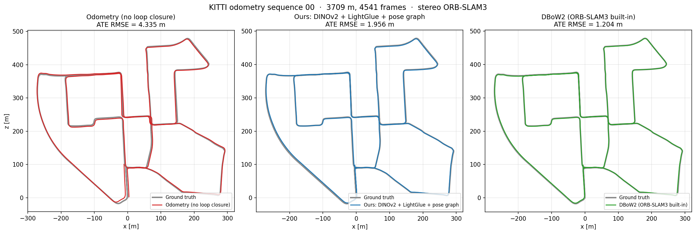
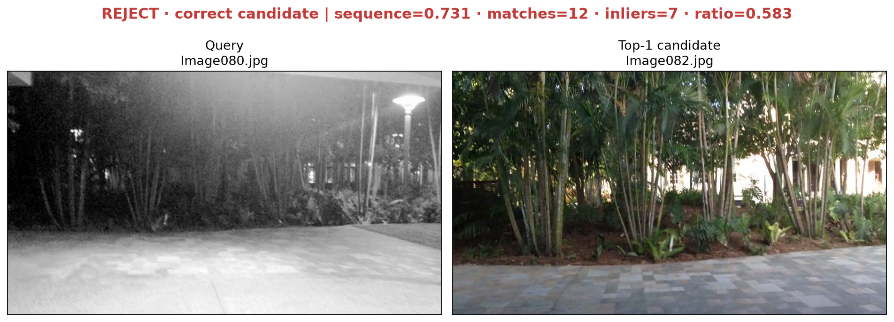

# Visual Place Recognition for SLAM Loop Closure

A loop-closure front end for SLAM: given the current frame, retrieve the same
place from a database of past keyframes, then decide whether to trust the match.

The interesting part of the problem is that the two failure modes pull in
opposite directions. The same place can look completely different across day and
night, while two different corridors can look nearly identical. And the cost is
asymmetric: a missed loop closure just delays a correction, but a false one
welds two unrelated places together and can distort the whole map irreversibly.

The project is built as a **classic-versus-modern comparison**. Each stage has
two implementations — hand-crafted or CNN on one side, self-supervised
transformer or learned matcher on the other — and every swap is motivated by a
measurement from the previous stage rather than by "this one is newer".

## At a Glance

On the held-out 30-frame night segment, zero-shot DINOv2 raises Recall@1 from
the fine-tuned ResNet18's **63.3% to 93.3%**; causal sequence matching reaches
**100%**. In a controlled geometry study, DISK + LightGlue raises the
correct/incorrect day-night inlier separation from ORB's **1.1x to 6.8x**.

Wired into a real SLAM trajectory — ORB-SLAM3 stereo on KITTI odometry 00, its
own loop closing disabled — the front end plus a hand-written pose-graph
optimiser cuts absolute trajectory error from **4.335 m to 1.956 m** over
3.7 km, with **97%** of accepted loop edges landing within 5 m of ground truth.

Those are small-sample results, not benchmark claims: one query moves the main
table by 3.3 points. The repository therefore reports bootstrap intervals and
separates **validation-time gate fitting** from **frozen-threshold test
evaluation**. Historical oracle sweeps remain labelled as such for provenance.

### In progress: inference profiling and deployment

A follow-up subproject in [`deploy/`](deploy/README.md) asks what each inference
optimisation — and low-precision quantisation in particular — costs in VPR
accuracy when the front end shares a robot's GPU budget. Profiling is done; the
TensorRT/INT8 ladder is next. Established so far:

- **Batch 1 is CPU-launch-bound.** From FP32 to BF16 the GPU work gets 3.5×
  faster, but end-to-end latency only 1.29× — the GPU is idle ~70% of the time,
  waiting for ~170 kernel launches.
- **A layout bug in DINOv2's positional-embedding interpolation** makes one
  bicubic kernel 7.8× slower than necessary (~46% of GPU work at BF16 batch 1);
  baking the embedding removes it, bit-exact.
- **Accuracy is scored with this repository's frozen-gate protocol unchanged**:
  the FP32 reference reproduces deployed F1 0.848 [0.747, 0.926] bit-for-bit.

## Overview

The system is a five-stage loop-closure pipeline. Each stage has a classic and a
modern implementation, selectable from the CLI, so the two can be compared directly:

```text
                 ┌──────────────────────────────────────────────────────┐
 query image ──► │ ① Retrieval                                          │
                 │    classic: ResNet18 -> GAP/GeM -> 512-D -> L2        │
                 │    modern:  DINOv2 ViT-S/14 -> patch pooling -> 384-D │
                 └───────────────────────┬──────────────────────────────┘
                                         │ Top-K candidates
                 ┌───────────────────────▼──────────────────────────────┐
                 │ ② Sequence re-ranking                                │
                 │    aggregate along the similarity matrix diagonal,    │
                 │    optionally searching several velocity ratios       │
                 └───────────────────────┬──────────────────────────────┘
                                         │ re-ranked candidates
                 ┌───────────────────────▼──────────────────────────────┐
                 │ ③ Geometric verification                             │
                 │    classic: ORB + RANSAC                              │
                 │    modern:  DISK + LightGlue + RANSAC                 │
                 └───────────────────────┬──────────────────────────────┘
                                         │ inlier count
                 ┌───────────────────────▼──────────────────────────────┐
                 │ ④ Accept / reject by a validation-fitted gate         │
                 │    similarity + inlier ratio, frozen before test      │
                 └───────────────────────┬──────────────────────────────┘
                                         │ accepted loops + relative pose
                 ┌───────────────────────▼──────────────────────────────┐
                 │ ⑤ Pose-graph optimisation                            │
                 │    stereo/RGB-D depth -> PnP -> SE(3) loop edge;      │
                 │    Gauss-Newton on SE(3) written from scratch         │
                 │    (src/se3.py, src/pose_graph.py) — no g2o/GTSAM     │
                 └──────────────────────────────────────────────────────┘
```

Stage ① alone is the original baseline; stages ②–④ and the validation-driven
training loop were added in v2; the modern variants and the open-set protocol
in v3; stage ⑤ and the KITTI integration in v5. See [`docs/experiments.md`](docs/experiments.md) for the full ablation,
including the negative results.

For a code-level walkthrough of the leakage-safe evaluation protocol, frozen
gates, structured proposals and the new results, see
[`docs/v4_evaluation_and_gating.md`](docs/v4_evaluation_and_gating.md).

For the derivation, assumptions, complexity, failure modes and interview Q&A of
the temporal constraint, see
[`docs/sequence_matching.md`](docs/sequence_matching.md).

Training supports both triplet loss and InfoNCE, with diagnostics that report
how much of each batch still produces gradient — which turned out to matter
more than the choice of loss.

## Project Structure

```text
loop-lens/
  data/
    gardens_point/
      database/
      query/
  outputs/
    visualizations/
  scripts/
    run_ablation.sh              # v2 ablation
    run_ablation_v3.sh           # v3 ablation (classic vs modern)
  docs/
    experiments.md               # full ablation with negative results
    sequence_matching.md         # temporal constraint derivation and Q&A
    v4_evaluation_and_gating.md  # frozen-gate protocol walkthrough
  slam/
    configs/                     # ORB-SLAM3 yaml, loop closing on and off
    runs/                        # trajectories and logs
  src/
    backbones.py                 # ResNet18 / DINOv2 factory, one contract
    dataset.py
    evaluate.py                  # metrics, sequence re-rank, gate, open-set
    confidence.py                # joint/logistic gate fitting and inference
    ground_truth.py              # metric-distance benchmark manifests
    extract_features.py
    geometric_verification.py    # ORB + RANSAC
    learned_matching.py          # DISK + LightGlue + RANSAC
    losses.py                    # InfoNCE + gradient diagnostics
    models.py                    # ResNet18 + GAP/GeM pooling
    retrieve.py
    rgbd_pose.py                 # PnP + RANSAC relative pose from depth
    pose_graph.py                # Gauss-Newton pose graph on SE(3)
    se3.py                       # Lie group utilities, self-tested
    slam_loop_closure.py         # end-to-end SLAM loop closure pipeline
    sequence_match.py            # simplified SeqSLAM, multi-velocity
    stereo_depth.py              # SGBM disparity -> depth, for KITTI
    train_triplet.py
    triplet_dataset.py
    visualize.py
    visualize_proposal.py        # render gate evidence and decisions
  tests/                         # confidence, metrics and causality tests
  deploy/                        # inference profiling & deployment (see deploy/README.md)
  README.md
```

## Dataset

This project uses a subset of the
[Gardens Point Walking dataset](https://huggingface.co/datasets/medwa126/GardensPointWalking).
It contains images from the same route captured under different conditions:

- `day_left`: daytime traversal from the left side of the path
- `day_right`: daytime traversal from the right side of the path
- `night_right`: nighttime traversal from the right side of the path

In the current setup:

```text
data/gardens_point/
  database/
    day_left/
      Image000.jpg ... Image099.jpg
  query/
    day_right/
      Image000.jpg ... Image099.jpg
    night_right/
      Image000.jpg ... Image099.jpg
```

The image index is used as a pseudo ground truth location. For example,
`query/day_right/Image023.jpg` is expected to match a nearby database image such
as `database/day_left/Image023.jpg`, allowing a small index tolerance.

## Installation

Create and activate a conda environment:

```bash
conda create -n vpr-loop-closure python=3.11
conda activate vpr-loop-closure
```

Install PyTorch with CUDA support, then install the remaining dependencies:

```bash
pip install torch torchvision --index-url https://download.pytorch.org/whl/cu128
pip install -r requirements.txt
```

`opencv-python` is needed for ORB geometric verification and `kornia` for the
DISK + LightGlue path. DINOv2 weights (~85 MB for ViT-S/14) are pulled from
`torch.hub` on first use.

After downloading the three Gardens Point traversals, normalize them into the
expected layout with:

```bash
python scripts/prepare_gardens_point.py \
  --day-left /path/to/day_left \
  --day-right /path/to/day_right \
  --night-right /path/to/night_right
```

Verify CUDA:

```bash
python - <<'PY'
import torch

print(torch.__version__)
print(torch.version.cuda)
print(torch.cuda.is_available())
print(torch.cuda.get_device_name(0) if torch.cuda.is_available() else "CPU only")
PY
```

Run the CPU-safe smoke suite:

```bash
bash scripts/run_smoke.sh
```

## Usage

### 1. Extract Database Features

```bash
python -m src.extract_features \
  --image-dir data/gardens_point/database \
  --output outputs/gardens_database_features.pt
```

### 2. Extract Query Features

```bash
python -m src.extract_features \
  --image-dir data/gardens_point/query \
  --output outputs/gardens_query_features.pt
```

Each `.pt` file stores the features, their source paths, and the configuration
they were produced with — earlier versions stored only the first two, which meant
guessing from the filename which checkpoint and resolution a file came from:

```python
{
    "features": Tensor[N, D],        # D = 512 (ResNet18) or 384 (DINOv2 ViT-S/14)
    "paths": list[str],
    "meta": {"backbone": ..., "pooling": ..., "image_size": ..., "checkpoint": ...},
}
```

Backbone, pooling and resolution are all flags. The backbone is fully
convolutional with adaptive pooling (and DINOv2 is a ViT), so changing
resolution needs no model changes:

```bash
# GeM pooling instead of GAP
python -m src.extract_features ... --pooling gem

# DINOv2, zero training. Note patch size 14, so use multiples of 14 (224, 448)
python -m src.extract_features ... --backbone dinov2_vits14 --dinov2-aggregation mean
```

To extract features with a triplet fine-tuned checkpoint, pass `--checkpoint`:

```bash
python -m src.extract_features \
  --image-dir data/gardens_point/query \
  --output outputs/gardens_query_features_triplet.pt \
  --checkpoint outputs/checkpoints/resnet18_triplet.pt
```

### 3. Retrieve Top-K Matches

```bash
python -m src.retrieve \
  --database outputs/gardens_database_features.pt \
  --query outputs/gardens_query_features.pt \
  --top-k 5
```

### 4. Evaluate Retrieval

```bash
python -m src.evaluate \
  --database outputs/gardens_database_features.pt \
  --query outputs/gardens_query_features.pt \
  --top-k 10 \
  --tolerance 3
```

The tolerance means that a match is treated as correct if the database image
index is within `±3` frames of the query image index.

`--top-k` must be at least `max(--recall-ks)`; the evaluator now fails fast instead of
silently truncating the slice and reporting a wrong `recall@10`.

Sequence re-ranking, geometric verification and the open-set protocol are opt-in:

```bash
# Sequence matching. --seq-causal uses only past frames, matching the online
# SLAM constraint. --seq-velocities searches several speed ratios; widening it
# is not free, see docs/experiments.md
python -m src.evaluate ... --seq-window 15 --seq-causal --seq-velocities 0.9,1.0,1.1

# Geometric verification. gate = accept/reject (default), rerank = reorder by
# inlier count (measurably harmful). orb is fast, lightglue works across
# day-night where orb is at chance level
python -m src.evaluate ... --geometric-verify --verifier lightglue --geometric-mode gate

# Open-set validation: fit a similarity gate and save it
python -m src.evaluate ... --split-name night_right \
  --min-index 0 --max-index 49 --db-exclude-range 30 39 \
  --gate-mode similarity --fit-thresholds \
  --thresholds-out outputs/gates/similarity.json

# Disjoint test segment: apply the frozen gate, emit CIs and proposals
python -m src.evaluate ... --split-name night_right \
  --min-index 50 --max-index 99 --db-exclude-range 70 79 \
  --thresholds-in outputs/gates/similarity.json \
  --bootstrap-samples 1000 --proposals-out outputs/proposals.json

# Joint sequence + geometry gate. Use the same pipeline flags in fit and test.
python -m src.evaluate ... --seq-window 15 --seq-causal \
  --geometric-verify --verifier lightglue --gate-mode joint \
  --split-name night_right --min-index 0 --max-index 49 \
  --db-exclude-range 30 39 \
  --fit-thresholds --thresholds-out outputs/gates/joint.json
```

`oracle/*` metrics scan thresholds on the reported split and describe score
separation only. `deployed/*` metrics use a gate frozen on a different split;
these are the numbers to cite as an operational accept/reject result.

For MSLS, RobotCar or another metric-ground-truth benchmark, provide a CSV with
`query_path,database_path,distance_m` rows. Paths must match the strings stored
in the feature artifacts; queries with no pair inside the distance threshold
are treated as open-set negatives:

```bash
python -m src.evaluate ... \
  --ground-truth-manifest data/benchmark/validation_pairs.csv \
  --distance-threshold-m 25 \
  --gate-mode similarity --fit-thresholds \
  --thresholds-out outputs/gates/benchmark.json
```

The adapter removes the Gardens Point frame-index assumption, but this
repository does not claim external-benchmark numbers until the corresponding
data and feature artifacts have actually been evaluated.

To evaluate a held-out segment, use `--split-name`, `--min-index`, and
`--max-index`:

```bash
python -m src.evaluate \
  --database outputs/gardens_database_features_triplet_split.pt \
  --query outputs/gardens_query_features_triplet_split.pt \
  --top-k 10 \
  --tolerance 3 \
  --split-name night_right \
  --min-index 70 \
  --max-index 99
```

### 5. Visualize Retrieval Results

```bash
python -m src.visualize \
  --database outputs/gardens_database_features.pt \
  --query outputs/gardens_query_features.pt \
  --query-index 123 \
  --top-k 5 \
  --output outputs/visualizations/night_top5_success_123.png
```

### 6. Train with Triplet Loss

The triplet training stage uses nighttime images as anchors, nearby daytime
images as positives, and far-away daytime images as negatives:

```bash
python -m src.train_triplet \
  --anchor-dir data/gardens_point/query/night_right \
  --database-dir data/gardens_point/database/day_left \
  --output outputs/checkpoints/resnet18_triplet_train_000_069.pt \
  --epochs 5 \
  --batch-size 16 \
  --lr 1e-4 \
  --margin 0.2 \
  --min-index 0 \
  --max-index 69
```

The v2 recipe adds a validation split so that model selection is driven by real retrieval
metrics rather than by training loss:

```bash
python -m src.train_triplet \
  --anchor-dir data/gardens_point/query/night_right \
  --database-dir data/gardens_point/database/day_left \
  --output outputs/checkpoints/resnet18_v2.pt \
  --epochs 8 --batch-size 16 --lr 1e-4 --margin 0.2 \
  --min-index 0 --max-index 59 \
  --db-max-index 56 \
  --val-min-index 60 --val-max-index 69 \
  --early-stop-patience 4
```

- `--val-*` enables per-epoch Recall@K evaluation, best-checkpoint saving and early stopping
- `--db-max-index` truncates the database during training so it does not touch the
  validation/test region (purged split)
- `--no-augment` / `--no-schedule` disable ColorJitter / cosine decay for ablations
- `--seed` matters here: the validation split is 10 frames, so Recall@1 moves by
  0.1 per query and ablations are not comparable without it

InfoNCE is available as an alternative loss. It uses every valid in-batch
negative rather than one sampled negative, and weights each by its softmax
probability, so hard negatives get more gradient with no explicit mining:

```bash
python -m src.train_triplet ... --loss infonce --batch-size 60 --tau 0.2
```

Both losses report how much of each batch still produces gradient, which turned
out to matter more than the choice of loss — triplet reaches 98% zero-gradient
triplets by epoch 6, and InfoNCE saturates too when the batch is small enough
that the in-batch task becomes trivial. See `docs/experiments.md`.

### 7. Close Loops on a SLAM Trajectory

Run ORB-SLAM3 with loop closing disabled to get an odometry trajectory, then let
this pipeline detect the loops and optimise the pose graph:

```bash
# Odometry only. slam/configs/*_loop_off.yaml appends `loopClosing: 0`.
# Note this disables the loop-closing thread but not map-point reuse, which on
# short indoor sequences already absorbs most of the drift — see experiments §6.1
cd slam/runs/kitti_off && stereo_kitti ORBvoc.txt ../../configs/kitti_loop_off.yaml \
  ~/datasets/KITTI/odometry/sequences/00

# Detect loops, recover metric relative poses, optimise
python -m src.slam_loop_closure \
  --dataset kitti \
  --trajectory slam/runs/kitti_off/CameraTrajectory.txt \
  --sequence ~/datasets/KITTI/odometry/sequences/00 \
  --output slam/runs/vpr_kitti.txt \
  --min-gap 100 --top-k 1 --min-inliers 60 --max-reproj 1.5 \
  --rot-info 1e4 --loop-info 10

evo_ape kitti ~/datasets/KITTI/dataset/poses/00.txt slam/runs/vpr_kitti.txt -a
```

- `--min-gap` is the causal constraint: only keyframes this many frames older are
  eligible, so temporally adjacent frames cannot masquerade as loops
- `--rot-info` weights the rotation block of the information matrix. It is not
  cosmetic: with an identity matrix, one metre of translation error costs the
  same as one radian (57 degrees) of rotation error, and even 2000 ground-truth
  loop edges only reach 4.335 -> 3.17 m. At `1e4` the same graph reaches 1.97 m
- `--dataset tum` works the same way with `--associations`, taking depth from the
  RGB-D channel instead of stereo SGBM

## Results

### SLAM integration: KITTI odometry 00

The front end is wired to a real trajectory. ORB-SLAM3 stereo runs with its own
loop closing disabled to produce odometry; the pipeline then detects loops with
DINOv2, verifies them with DISK + LightGlue, recovers a metric SE(3) relative
pose by PnP on stereo depth, and optimises a pose graph written from scratch.



| Configuration | ATE RMSE | Max |
| --- | ---: | ---: |
| Odometry, loop closing disabled | 4.335 m | 8.54 m |
| **Ours: DINOv2 + LightGlue + pose graph** | **1.956 m** | 3.82 m |
| DBoW2, ORB-SLAM3 built-in loop closing | 1.204 m | 3.28 m |

Loop edges are accurate: of the 763 accepted, **97% lie within 5 m** of ground
truth (median 0.89 m, median 1213 PnP inliers, median reprojection error
0.84 px). This holds even though retrieval alone is weak on this sequence —
AUROC 0.896 and only 17% top-1 hit rate — which is the project's recurring
finding that recall is cheap and precision must come from the second stage.

Substituting ground truth for either the detected loop pairs or the estimated
relative poses does **not** improve the result (1.956 m measured, 2.029 m with
ground-truth relative poses, 2.036 m with ground-truth pairs). The remaining
error therefore comes from the pose-graph formulation, not the front end: unlike
ORB-SLAM3, this back end has no map points and runs no bundle adjustment. See
[`docs/experiments.md`](docs/experiments.md) §6 for the full decomposition, the
information-matrix ablation and the caveats.

### Retrieval

Using 100 database images from `day_left` and 200 query images from `day_right`
and `night_right`, the pretrained ResNet18 baseline obtains:

| Query split | Recall@1 | Recall@5 | Recall@10 | Precision@5 |
| --- | ---: | ---: | ---: | ---: |
| `day_right` | 0.9600 | 1.0000 | 1.0000 | 0.8020 |
| `night_right` | 0.5100 | 0.7400 | 0.8700 | 0.3920 |

These results show that pretrained ResNet18 descriptors handle moderate lateral
viewpoint changes well, but performance drops under stronger day-night
appearance changes.

### Held-out ablation

All rows are evaluated on the **held-out segment `night_right` Image070–099**
(30 queries), which never participates in training. Reproduce with
`bash scripts/run_ablation_v3.sh`.

The project was built in two passes: first a classic pipeline (ResNet18 +
triplet + ORB) to establish where each stage breaks, then each stage swapped
for a modern replacement, with the earlier measurement as the stated motive.

| # | Configuration | R@1 | R@5 | P@5 | R@100%P |
| --- | --- | ---: | ---: | ---: | ---: |
| ① | ResNet18-GAP, pretrained | 0.500 | 0.767 | 0.433 | 0.000 |
| ② | ResNet18-**GeM**, zero training | 0.533 | 0.800 | 0.407 | 0.000 |
| ③ | ResNet18-GAP + **triplet** | 0.633 | 0.933 | 0.527 | 0.000 |
| ④ | ResNet18-GAP + **InfoNCE** | 0.633 | 0.900 | 0.593 | 0.000 |
| ⑤ | **DINOv2 CLS**, zero training | **0.933** | 0.967 | 0.753 | 0.167 |
| ⑥ | **DINOv2 patch-mean**, zero training | **0.933** | 0.967 | **0.800** | **0.900** |
| ⑦ | ⑥ + causal sequence matching | **1.000** | 1.000 | 0.933 | **1.000** |

**Zero-training DINOv2 beats the fine-tuned ResNet18 by 30 points.** With only
60 training frames, swapping in a feature that already generalises beats
fine-tuning one that does not — consistent with the 34.8-point generalisation
gap measured for the fine-tune. On `day_right` (viewpoint change only) every
configuration sits at 0.94–0.98, so the gain is specific to the cross-domain
case.

Rows ⑤ and ⑥ are worth a second look: identical Recall@1, but
Recall@100%Precision differs by 5.4x. Patch aggregation is not just as
accurate as the CLS token, its similarity scores provide far better confidence separation —
which matters more than average accuracy when a single false loop closure can
tear the map apart.

### Geometric verification: closing a negative result

v2 found that ORB inlier counts carry no signal across day–night pairs and
argued the cause was the descriptor rather than RANSAC. v3 tests that by
swapping only the feature and matcher, keeping the RANSAC criterion identical.
Measured over 32 sample points scored on exactly the same pairs:

| Method | Domain | Correct | Incorrect | Ratio | Separable |
| --- | --- | ---: | ---: | ---: | ---: |
| ORB | day_right | 126.5 | 26.9 | 4.7x | 97% |
| ORB | night_right | 27.0 | 25.7 | **1.1x** | **56%** |
| DISK+LightGlue | day_right | 446.4 | 9.6 | 46.7x | 100% |
| DISK+LightGlue | night_right | 62.5 | 9.2 | **6.8x** | **72%** |

Chance level is 50%, so ORB at 56% is effectively random. The failure was in
the descriptor. Still, 72% remains well short of the 100% seen in-domain, and
LightGlue's night distribution is heavily skewed (mean 62.5, median 18).

### Historical open-set oracle evaluation

Removing database frames 30–49 leaves 14 of 100 night queries with no valid
match, so they *should* be rejected. This is what finally makes the gate and
Recall@100%Precision measurable — under the closed-set protocol used earlier,
rejecting was always wrong.

The following v3 table swept thresholds on the same 100-query split. It is kept
to document how the next failure was discovered, but it is an **oracle
separation result**, not a deployable threshold result. The current
`run_ablation_v3.sh openset` instead fits on frames 000–049 and applies the
frozen gate to frames 050–099.

| Configuration | best F1 | R@100%P |
| --- | ---: | ---: |
| DINOv2, single frame | 0.874 | 0.233 |
| + causal sequence matching | **0.912** | **0.686** |
| + ORB gate | 0.859 | 0.000 |
| + LightGlue gate | 0.849 | 0.326 |

Sequence matching nearly triples Recall@100%Precision, so it improves not just
ranking but the reliability of the confidence score. Adding a geometric gate
then *hurt* because the old implementation replaced similarity confidence with
the inlier count.

The replacement has now been implemented and evaluated with disjoint gate
fitting: validation uses queries 000–049 with database frames 30–39 removed;
test uses queries 050–099 with frames 70–79 removed. Thresholds are selected
only on validation and frozen before test.

| Frozen gate | Score threshold | Inlier-ratio threshold | Test precision | Test recall | Test F1 | FP |
| --- | ---: | ---: | ---: | ---: | ---: | ---: |
| DINOv2 single frame | 0.684 | — | 0.848 | 0.848 | **0.848** | 7 |
| Sequence only | 0.792 | — | 0.958 | 0.500 | 0.657 | 1 |
| Sequence + ORB | 0.792 | 0.042 | 0.958 | 0.500 | 0.657 | 1 |
| Sequence + LightGlue | 0.792 | 0.000 | 0.958 | 0.500 | 0.657 | 1 |

With 5,000 query bootstraps, the 95% F1 intervals are `[0.747, 0.926]` for the
single-frame gate and `[0.516, 0.775]` for the sequence gate. The intervals are
wide, reinforcing that this remains a diagnostic result on a small route.

The honest result is more nuanced than the oracle table. Sequence matching
improves test Recall@1 from 0.82 to 0.92 and open-set AUPRC from 0.791 to 0.947,
but its validation-fitted threshold transfers poorly to the later route segment:
precision rises while recall and deployed F1 fall. Geometry does **not** repair
that transfer—validation makes the ORB condition permissive and ignores
LightGlue entirely. The frozen test also produces one false positive, showing
why the oracle 100%-precision number was optimistic.

This synthetic open-set protocol also removes a contiguous database range,
compressing the sequence matrix so that array adjacency no longer always means
temporal adjacency. The drop therefore cannot yet be attributed purely to route
distribution shift; see [`docs/sequence_matching.md`](docs/sequence_matching.md)
for the confound and the timestamp-aware fix.

In gate mode only Top-1 now receives geometric verification; on the current CPU
environment this costs about 23 ms per query for ORB and 1.0 s for LightGlue.
Runtime depends strongly on hardware.

**Caveats worth reading before citing any of this** — see
[`docs/experiments.md`](docs/experiments.md):

- Held-out is 30 queries, so one query is 3.3 points; the validation split is
  10 frames, so one query is 10 points. Several differences here are noise.
- Gardens Point sequences are frame-aligned and traversed at near-constant
  speed, which perfectly satisfies the sequence-matching assumption. Widening
  the velocity search to 0.5–1.5x drops night Recall@1 from 0.890 to 0.780, so
  the assumption is doing real work.
- InfoNCE's mechanism advantage is measurable (gradient diagnostics) but does
  not translate into a measurable retrieval gain at this dataset size.

### Training curve: loss does not track retrieval quality

```text
Epoch 1: loss 0.1246 | val R@1 0.8000   <- best
Epoch 2: loss 0.0308 | val R@1 0.7000
Epoch 3: loss 0.0085 | val R@1 0.6000
Epoch 4: loss 0.0052 | val R@1 0.5000
Epoch 5: loss 0.0020 | val R@1 0.3000   -> early stop
```

Training loss falls monotonically to 0.002 while validation Recall@1 falls monotonically
from 0.80 to 0.30. The original fixed 5-epoch schedule was training four epochs too long,
and without a validation split this is completely invisible.

## Qualitative Examples

### Night Success

`night_success_118.png` shows a nighttime query where the top retrievals are
nearby correct locations. The descriptor captures stable global layout cues such
as corridor direction, doorway position, lighting structure, and indoor geometry.


### Top-1 Failure, Top-5 Success

`night_top5_success_123.png` shows a case where the top-1 result is wrong, but a
correct nearby place appears in the top-5 candidates. This is important for SLAM:
VPR can propose loop-closure candidates, while geometric verification can later
accept or reject them.


### Night Failure

`night_failure_103.png` shows a failure case where the correct place does not
appear in the top-5 results. The pretrained descriptor is confused by strong
illumination changes and visually similar corridor-like structures.


### Frozen-gate decision evidence

The evaluator can emit a `LoopClosureProposal` JSON for every query. This view
shows a correct geometric candidate rejected by the validation-fitted sequence
threshold—a concrete example of threshold transfer, rather than just another
Top-K retrieval montage.



```bash
python -m src.visualize_proposal \
  --proposals outputs/proposals.json --index 30 \
  --output outputs/visualizations/frozen_gate_false_negative_080.png
```

## Discussion

In a SLAM system this module sits at the front of a funnel that tightens stage
by stage:

```text
query image -> top-k candidates -> geometric verification -> consistency check -> loop closure
```

The first stage should favour recall: a correct place only has to reach the
candidate list, because later stages can reject the wrong ones — but anything
missed here is unrecoverable. Final precision is the later stages' job. That is
why Recall@K is the headline retrieval metric, while Recall@100%Precision is the
one that reflects what SLAM actually needs.

Five findings shaped how this project ended up:

1. **Validation-driven model selection mattered more than any modelling change.**
   The fixed 5-epoch schedule was training four epochs past the optimum —
   invisible if you only watch the loss, which fell to 0.002 while validation
   Recall@1 fell to 0.30.

2. **The fine-tuning result was better read as a diagnosis than as a result.**
   A 34.8-point generalisation gap says the model memorised 60 frames rather
   than learning something transferable. That pointed at the feature, not the
   training recipe — and swapping in zero-training DINOv2 gained 30 points where
   fine-tuning had gained 13.

3. **Sequence matching is the single largest lever on this dataset**, and it
   improves confidence separation as much as ranking: Recall@100%Precision goes
   from 0.233 to 0.686. But the gain rests on the trajectory being continuous and
   traversed at a stable speed, which Gardens Point satisfies unusually well.

4. **A negative result was worth as much as a positive one.** ORB inlier counts
   sit at chance level across day–night pairs. The claim that this was the
   descriptor's fault rather than RANSAC's was testable, and swapping in
   DISK + LightGlue under an identical RANSAC criterion recovered separation from
   1.1x to 6.8x.

5. **Recall@1 hides things.** DINOv2's CLS and patch-mean aggregations score
   identically on Recall@1 (0.933) but differ 5.4x on Recall@100%Precision. When
   one false loop closure can tear the map apart, how trustworthy the top
   prediction is matters more than how often it is right on average.

## Next Steps

Ordered by how much they would change the conclusions rather than by effort:

- **Validate on a standard benchmark** (Nordland / Pitts30k / MSLS) with metric
  ground truth. Every number here comes from 30 held-out queries on one campus
  route, where a single query is worth 3.3 points.
- **Evaluate the new joint gate on a larger benchmark.** The implementation now
  fits similarity and inlier-ratio thresholds on validation and freezes them for
  test, but Gardens Point is too small to establish how well those thresholds
  transfer.
- **Multi-velocity sequence search with a proper velocity prior.** The search
  exists but widening it blindly costs accuracy, because it also gives wrong
  matches more chances to score high.
- **Open-set with real distractors**, not just a removed frame range — a real
  database contains mostly places the robot has never seen.
- Semi-hard negative mining, PCA-whitening, and FAISS/HNSW indexing: standard
  and cheap, but none of them are what currently limits this system.

## Notes

Large downloaded datasets and generated `.pt` feature files should usually not
be committed to Git. The repository should contain the code, documentation, and a
small number of representative visualization images.
