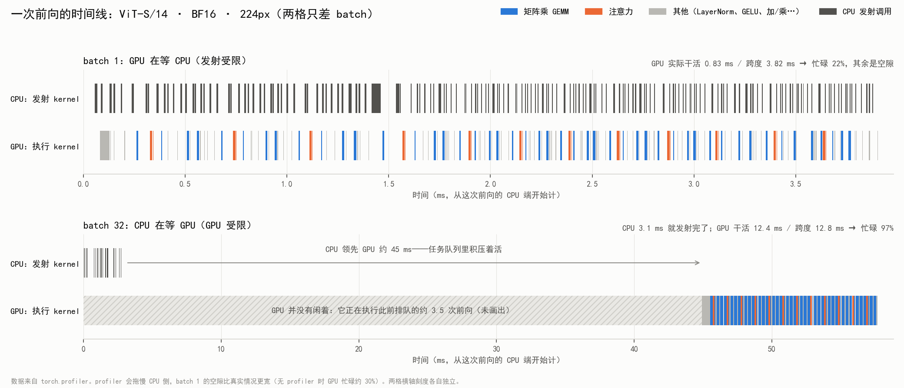
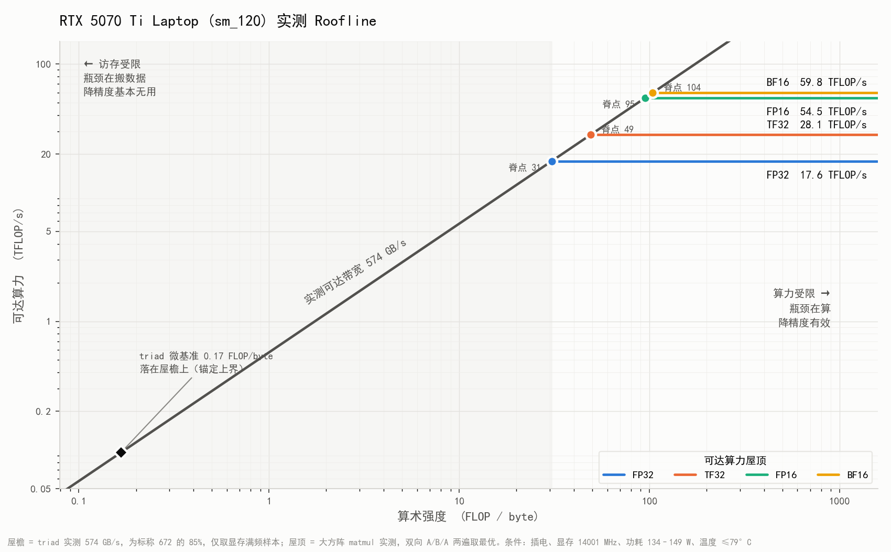

# Inference Profiling and Deployment of the DINOv2 VPR Front End

> **Status: in progress.** Stages 0–3 (environment, machine limits, baseline,
> profiling) are complete. Stage 4 — the optimisation ladder
> (`torch.compile` → ONNX → TensorRT FP16 → INT8) and its accuracy cost — is next.
> The experiment ledger [`EXPERIMENTS.md`](EXPERIMENTS.md) is written in Chinese,
> following the repository's convention for analysis documents.

## Why

The loop-closure front end is **not** on the real-time critical path of SLAM, so
"it is too slow" is not the motivation. On a robot, however, SLAM, loop closure,
planning and perception share one GPU's **compute, memory and power budget**.
The question this subproject answers is:

> What does each optimisation — and low-precision quantisation in particular —
> actually cost in downstream VPR accuracy, and where is the knee?

Accuracy is always measured with the repository's own frozen-gate protocol
(`src/evaluate.py`, unchanged), never with a new metric.

## Findings so far

**1. Batch 1 is CPU-launch-bound, so lower precision barely helps latency.**
ViT-S/14 issues 154–178 kernels per forward. At BF16 batch 1 the GPU is busy only
~30% of the time; the rest is waiting for the CPU to launch the next kernel.

| batch 1, 224 px | GPU kernel time | Wall clock (no profiler) |
| --- | ---: | ---: |
| FP32 | 2.96 ms | 3.37 ms |
| BF16 | 0.85 ms | 2.61 ms |
| **ratio** | **3.50×** | **1.29×** |

The GPU work does get 3.5× faster — matching the measured Tensor Core ratio — but
the user sees 1.29×. This predicts that CUDA Graphs, not precision, are the lever
at batch 1 (to be tested in stage 4).



**2. A layout bug in DINOv2's positional-embedding interpolation.**
In the original model, one bicubic interpolation kernel took **~720 µs** — about
46% of all GPU work at BF16 batch 1. The same interpolation on a contiguous tensor
takes 92 µs. DINOv2 feeds it `reshape(...).permute(0, 3, 1, 2)`, a non-contiguous
view whose neighbouring pixels are 1.5 KB apart; changing only the layout makes it
**7.8× slower** with bit-identical output. Since the inference resolution is fixed,
the wrapper bakes the interpolated embedding into a constant (bit-exact against the
original on all 300 images), saving 3–17% latency where the effect is measurable. If resolution must stay dynamic,
a single `.contiguous()` recovers most of it.

**3. Measured limits, not spec-sheet limits.**

| | Measured | Note |
| --- | ---: | --- |
| Bandwidth (triad) | 574 GB/s | 85% of the 672 GB/s spec |
| FP32 / TF32 | 17.6 / 28.1 TFLOP/s | TF32 speed-up 1.60×; the model at batch 32 gets 1.58× |
| FP16 / BF16 | 54.5 / 59.8 TFLOP/s | BF16's micro-benchmark edge does **not** transfer to the model |



**4. Measurement traps found and guarded against.**
- Under WSL2, oversubscribing VRAM does not raise OOM: it silently pages to system
  memory (≈500 → 35 GB/s). Every measurement records peak memory against free memory.
- The memory clock drops by a third under load. A probe with a memory-bound control
  shows ViT latency is insensitive to it (±4% vs +52% for the control).
- An intermittent CPU-side slow state doubles batch-1 latency with identical GPU
  kernel time. Its trigger was not identified; batch-1 comparisons therefore use
  paired, interleaved rounds.
- Three of my own measurement errors (profiler annotations counted as kernels, a
  truncated timeline window, a single A/B/A that reversed a sign) are documented in
  the ledger together with how they were caught.

**Accuracy reference.** FP32 features extracted through the repository's own entry
point reproduce the README bit-for-bit: deployed F1 **0.848 [0.747, 0.926]**, oracle
best F1 0.874. The frozen gate fitted here is the one every lower-precision variant
will be evaluated against.

## Layout

```text
deploy/
  EXPERIMENTS.md        experiment ledger: expectation → measurement → explanation
  env/                  check_env.py (self-checks, incl. VRAM-spill probe), requirements
  bench/                timing.py (CUDA-event timer), machine limits, roofline, baseline sweep
  export/wrapper.py     VPRDescriptor: baked pos-embed, tensor in/out, equivalence gate
  eval/run_protocol.sh  runs src/evaluate.py's frozen-gate protocol on any feature set
  profile/              torch.profiler analysis, timelines, CPU-affinity experiments
  diagnostics/          one script per ledger claim (layout, spill, clock, kernels, sampler)
  results/              JSON / CSV / PNG evidence (engines, ONNX, .pt are gitignored)
```

`deploy/` only consumes `src/` through its public contracts
(`DINOv2FeatureExtractor`, the `{features, paths, meta}` artifact, and
`get_default_transform`); it does not modify `src/`.

## Reproduce

```bash
# environment (python 3.11; torch must match the main project's build)
conda create -n vpr-deploy --clone vpr-loop-closure
pip install -r deploy/env/requirements-deploy.txt
python deploy/env/check_env.py

# stage 1: machine limits and roofline
python -m deploy.bench.machine_limits && python -m deploy.bench.roofline

# stage 2: equivalence gate, baseline sweep, FP32 accuracy reference
python -m deploy.export.wrapper --self-check
python -m deploy.bench.bench_torch --sweep && python -m deploy.bench.bench_torch --side
bash deploy/eval/run_protocol.sh ref_fp32 deploy/results/ref/fp32_database.pt deploy/results/ref/fp32_query.pt

# stage 3: profiling and diagnostics
python -m deploy.profile.profile_torch
python -m deploy.diagnostics.bicubic_layout    # the 7.8x layout effect
```

Hardware used: RTX 5070 Ti Laptop (Blackwell, sm_120, 12 GB), WSL2, PyTorch
2.11+cu128, TensorRT 10.16 (cu12). All numbers were measured on this machine,
plugged in; absolute values will differ elsewhere, the method should not.
